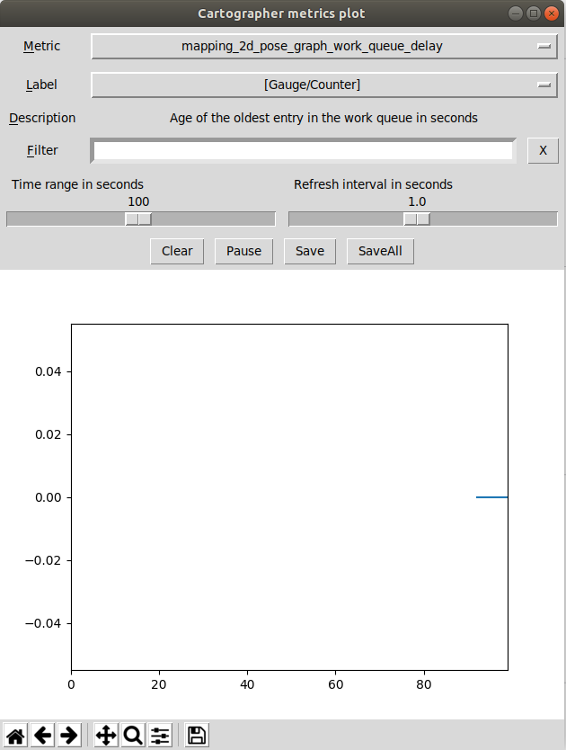

A simple metrics reader for Cartographer
=====================

# Introduction

[Cartographer](https://google-cartographer.readthedocs.io/en/latest/) is a classic Lidar SLAM framework. It provides the main algorithm and the ros-wrapper separately, [cartographer](https://github.com/cartographer-project/cartographer) and [cartographer_ros](https://github.com/cartographer-project/cartographer_ros) respectively.

However it's not convenient to debug the cartoghrapher algorithm, since it has many submodules running in an asynchronous manner. To overcome this problem, cartographer designed a metrics factory which can provide a mechanism to publish internal state variables when needed.

We utilize this mechanism, and implement this metrics reader to observe state variable in an easier way.

## GUI

```shell
python read_metrics.py
```



## CLI

```shell
python read_metrics_cli.py
```


You can add metrics filter through `-f` option. Please refer to the help message for more options

```
usage: read_metrics_cli.py [-h] [--window_size WINDOW_SIZE]
                           [--lookup_interval LOOKUP_INTERVAL]
                           [--dump_dir DUMP_DIR]
                           [--filters FILTERS [FILTERS ...]]

Plot Cartographer Metrics

optional arguments:
  -h, --help            show this help message and exit
  --window_size WINDOW_SIZE, -s WINDOW_SIZE
                        How long the monitor window will be.
  --lookup_interval LOOKUP_INTERVAL, -i LOOKUP_INTERVAL
                        The period between two service call, unit: sec
  --dump_dir DUMP_DIR, -d DUMP_DIR
                        Folder to save plots to
  --filters FILTERS [FILTERS ...], -f FILTERS [FILTERS ...]
                        filters through metrics name
```

## Enjoy
